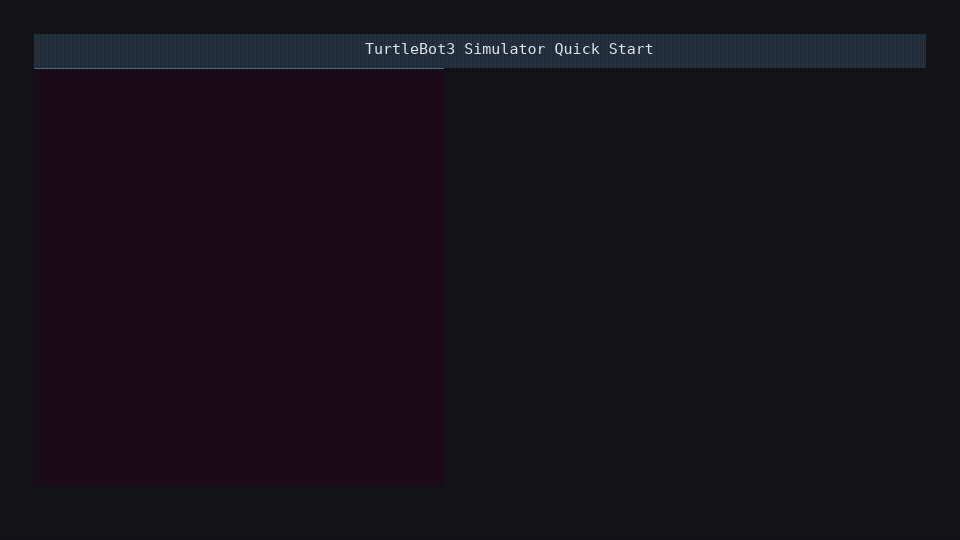

# TurtleBot3 Simulator on ROS 2 Humble

This workspace runs the ROS 2 Humble TurtleBot3 Gazebo simulation in Docker.
CycloneDDS is used as the ROS middleware implementation.

## Requirements

- Docker
- Docker Compose v2
- Linux desktop environment with X11

## Quick Start

```bash
./scripts/build.sh
./scripts/run-gazebo.sh
```



The default TurtleBot3 model is `burger`. To use another model:

```bash
TURTLEBOT3_MODEL=waffle_pi ./scripts/run-gazebo.sh
```

## Useful Commands

Open a shell inside the container:

```bash
./scripts/shell.sh
```

Launch the Gazebo world manually:

```bash
docker compose run --rm sim ros2 launch turtlebot3_gazebo turtlebot3_world.launch.py
```

Launch an empty world:

```bash
docker compose run --rm sim ros2 launch turtlebot3_gazebo empty_world.launch.py
```

Run keyboard teleoperation from another terminal:

```bash
docker compose run --rm sim ros2 run turtlebot3_teleop teleop_keyboard
```

```bash
RMW_IMPLEMENTATION=rmw_cyclonedds_cpp
CYCLONEDDS_URI=file:///etc/cyclonedds/cyclonedds.xml
```

## Directory Map

```text
.
|-- Dockerfile
|-- docker-compose.yml
|-- docker/
|   |-- cyclonedds.xml
|   `-- ros_entrypoint.sh
|-- docs/
|   `-- assets/
|       `-- quick-start.gif
|-- scripts/
|   |-- build.sh
|   |-- create-quick-start-gif.sh
|   |-- run-gazebo.sh
|   `-- shell.sh
|-- src/
|   `-- .gitkeep
|-- .dockerignore
|-- .gitignore
|-- LICENSE
`-- README.md
```

## Notes
- To use an NVIDIA GPU, install NVIDIA Container Toolkit on the host and add GPU options to the Compose configuration.

## License

This repository is licensed under the Apache License 2.0. See `LICENSE`.
Third-party software installed by the Docker image, including ROS 2, TurtleBot3, Gazebo, and CycloneDDS, is distributed under each upstream project's license.

---

# ROS 2 Humble TurtleBot3 Simulator

このワークスペースは、ROS 2 Humble の TurtleBot3 Gazebo simulation を Docker 上で起動します。
ROS middleware implementation には CycloneDDS を使います。

## 必要環境

- Docker
- Docker Compose v2
- X11 が使える Linux desktop environment

## クイックスタート

```bash
./scripts/build.sh
./scripts/run-gazebo.sh
```


turtlebot3 burger以外のmodel を使う場合:

```bash
TURTLEBOT3_MODEL=waffle_pi ./scripts/run-gazebo.sh
```

## 便利なコマンド

コンテナ内の shell を開く:

```bash
./scripts/shell.sh
```

Gazebo world を手動起動する:

```bash
docker compose run --rm sim ros2 launch turtlebot3_gazebo turtlebot3_world.launch.py
```

空の world を起動する:

```bash
docker compose run --rm sim ros2 launch turtlebot3_gazebo empty_world.launch.py
```

別ターミナルから keyboard teleoperation を起動する:

```bash
docker compose run --rm sim ros2 run turtlebot3_teleop teleop_keyboard
```

## ディレクトリマップ

```text
.
|-- Dockerfile
|-- docker-compose.yml
|-- docker/
|   |-- cyclonedds.xml
|   `-- ros_entrypoint.sh
|-- docs/
|   `-- assets/
|       `-- quick-start.gif
|-- scripts/
|   |-- build.sh
|   |-- create-quick-start-gif.sh
|   |-- run-gazebo.sh
|   `-- shell.sh
|-- src/
|   `-- .gitkeep
|-- .dockerignore
|-- .gitignore
|-- LICENSE
`-- README.md
```

## 補足
- NVIDIA GPU を使う場合は、host に NVIDIA Container Toolkit を入れたうえで Compose configuration に GPU options を追加してください。

## ライセンス

このリポジトリのライセンス詳細は `LICENSE` を参照してください。
Docker image 内で install される ROS 2、TurtleBot3、Gazebo、CycloneDDS などの third-party software は、それぞれの upstream project の license に従います。
